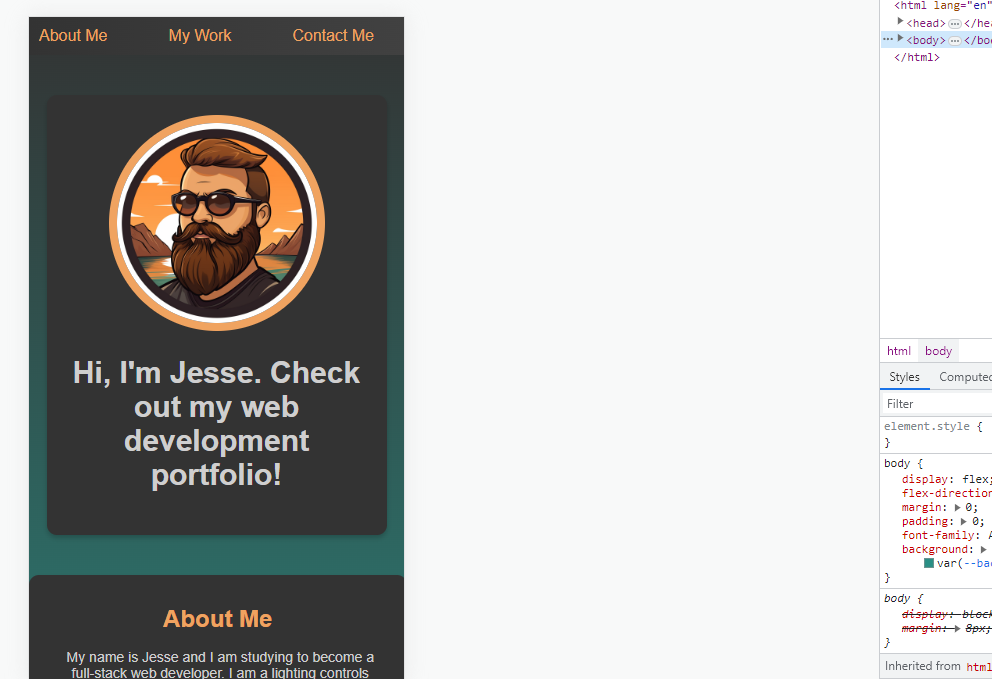

# My Portfolio

## Description

I built this webpage to start my portfolio for front-end web development. I have learned a lot about advanced CSS during this project. The purpose of this project is to add on as I learn and apply the skills I'm building to highlight my work. 

## Link to Deployed Page

https://sidecontroljs.github.io/My_Portfolio/

## Screenshots of Deployed Webpage

Screenshot of Mobile Friendly Functionality:

## Local Repo Screenshot

## Credits

I used this README template: 
https://coding-boot-camp.github.io/full-stack/github/professional-readme-guide

I read through these pages and videos to help me with this Challenge: 
https://developer.mozilla.org/en-US/docs/Learn/CSS/CSS_layout/Responsive_Design
https://developer.mozilla.org/en-US/docs/Web/CSS/CSS_media_queries/Using_media_queries
https://flexbox.malven.co/
https://developer.mozilla.org/en-US/docs/Web/CSS/transition

I used midjourney to create my avatar using midjourney AI. 
